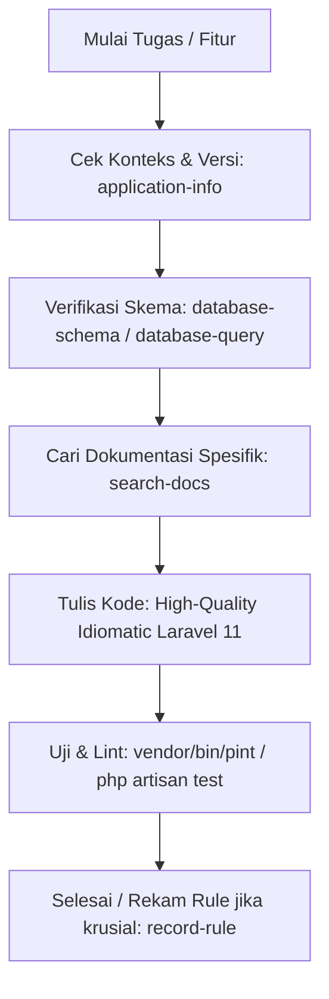

# Project Rule: Standarisasi Wajib Penggunaan MCP Laravel Boost (AI Acceleration & Quality)

Dokumen ini menetapkan aturan baku bagi pengembang dan agen kecerdasan buatan (AI) dalam mewajibkan pemanfaatan **MCP Server `laravel-boost`** di lingkungan Sollu App. Penggunaan MCP ini bertujuan mempercepat alur kerja (*acceleration*), memperkuat keakuratan asistensi AI (*AI assistance*), dan menjamin dihasilkannya kode berstandar tinggi (*high-quality code*) sesuai ekosistem Laravel 11.

---

## 1. Prinsip Utama (Mandatory MCP Enforcement)

MCP `laravel-boost` terhubung langsung dengan aplikasi Laravel Sollu App melalui package `laravel/boost`. Seluruh agen AI dan pengembang **WAJIB** memanfaatkan fungsionalitas MCP ini sebagai instrumen utama dalam investigasi, implementasi, verifikasi, dan debugging.

> [!IMPORTANT]
> **DILARANG MENEBAK SKEMA, DOKUMENTASI, ATAU ERROR RUNTIME!**
> 1. Dilarang mengasumsikan nama kolom, tipe data, atau constraint relasi tanpa memeriksa skema via `database-schema` atau `sollu-db`.
> 2. Dilarang mengasumsikan signature method atau sintaks framework/package tanpa memeriksa dokumentasi versi spesifik via `search-docs`.
> 3. Dilarang menganalisa error atau kegagalan request tanpa memeriksa jejak log resmi via `last-error` atau `read-log-entries`.

---

## 2. Matriks Tool MCP `laravel-boost` & Pemicu Wajib (Trigger Matrix)

| Tool MCP | Fungsi Utama | Kapan Wajib Dipicu (Mandatory Trigger) |
|---|---|---|
| `search-docs` | Pencarian dokumentasi resmi *version-specific* (Laravel, Inertia, Vue, Tailwind, Pest, Sanctum, Reverb, dll). | **SEBELUM** menulis implementasi baru atau refactoring pada fitur yang bergantung pada API framework/package. Wajib digunakan sebelum mengasumsikan pola atau mencari di web eksternal. |
| `database-schema` | Inspeksi detail skema tabel database dari sudut pandang koneksi Laravel. | **SEBELUM & SAAT** membuat atau mengedit Model, Form Request, Migration, Service query, atau relasi Eloquent. |
| `database-query` | Eksekusi query SQL eksploratif secara aman pada database aplikasi. | Saat memverifikasi nilai riil data (misal: memeriksa isi status enum di database, relasi foreign key, atau hasil agregasi). |
| `last-error` | Mengambil exception terakhir beserta stack trace lengkap dan konteks baris kode dari log Laravel. | **LANGKAH PERTAMA** saat terjadi HTTP 500, unhandled exception, atau kegagalan request di backend. |
| `read-log-entries` | Membaca log entry spesifik dari `storage/logs/laravel.log` dengan filter dan limit terstruktur. | Saat menganalisa riwayat kegagalan proses latar belakang (*background jobs*), audit trail, atau multi-step debugging. |
| `application-info` | Melihat versi PHP (8.3), Laravel (11.x), engine DB, dan daftar lengkap package Composer & NPM terinstal. | Di awal sesi kerja saat memerlukan kepastian versi pustaka yang didukung sebelum mendesain solusi teknis. |
| `browser-logs` | Mengambil log konsol dari sisi klien/browser. | Saat melakukan debugging frontend Inertia/Vue atau menangani error JavaScript di sisi browser. |
| `record-rule` | Menyimpan keputusan arsitektural dan aturan proyek agar diwarisi oleh agen dan anggota tim berikutnya. | Saat menetapkan konstrain arsitektur baru, perbaikan pola yang sering berulang, atau anti-pattern penting. |
| `get-absolute-url` | Mendapatkan URL absolut dari route/path relatif aplikasi. | Saat menguji webhook, integrasi callback pihak ketiga (Midtrans, dll), atau testing browser. |

---

## 3. Protokol Alur Kerja Standar (Workflow Protocol)

### 3.1. Alur Pembuatan / Refactoring Fitur Baru

1. **Context & Stack Check:** Gunakan `application-info` untuk memastikan pustaka yang tersedia.
2. **Schema Validation:** Gunakan `database-schema` untuk memastikan tabel, kolom, nullability, dan relasi target.
3. **Official Docs Retrieval:** Gunakan `search-docs` (misal: mencari sintaks `casts()`, Inertia deferred props, Form Request validation rules) untuk memastikan penggunaan best practice resmi versi aktif.
4. **Implementasi Berkualitas:** Tulis kode sesuai kaidah clean architecture, tanpa magic string (`sollu-enums`), dan modular (`sollu-modular`).
5. **Verifikasi:** Jalankan pengujian dan linter Laravel Pint.

### 3.2. Alur Debugging & Penanganan Bug Runtime
1. **Langkah 1 (Instant Diagnostic):** Jalankan `last-error` untuk membaca exception mentah, pesan error, nama file, dan baris kode penyebab kegagalan.
2. **Langkah 2 (Data State Inspection):** Jika error berkaitan dengan database atau enum unmarshaling, jalankan `database-query` untuk memeriksa data aktual di tabel.
3. **Langkah 3 (Fix & Verify):** Lakukan perbaikan pada source code dan verifikasi kembali dengan unit/feature test.

---

## 4. Manfaat & Standar Kualitas (Quality Benchmark)

Dengan mewajibkan penggunaan MCP `laravel-boost`:
- **Akselerasi:** Waktu diagnosa error berkurang drastis tanpa perlu mencari log secara manual atau menjalankan command berulang.
- **Asistensi AI Presisi:** AI tidak mengalami halusinasi (*zero hallucinations*) terkait versi framework atau nama kolom database karena didukung data live dari aplikasi.
- **Kualitas Kode Tinggi:** Kode yang dihasilkan selalu mengikuti konvensi Laravel 11 modern, ramah performa, dan selaras dengan skema database riil.
