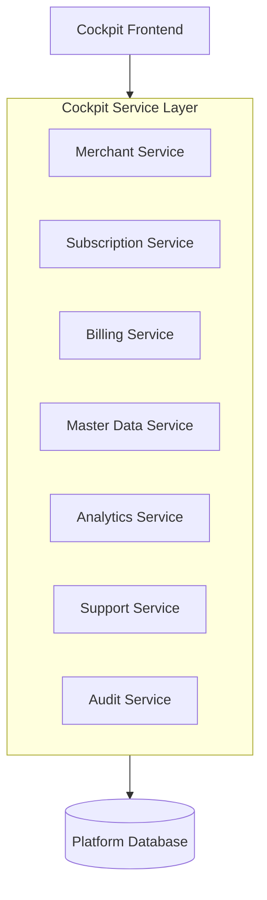
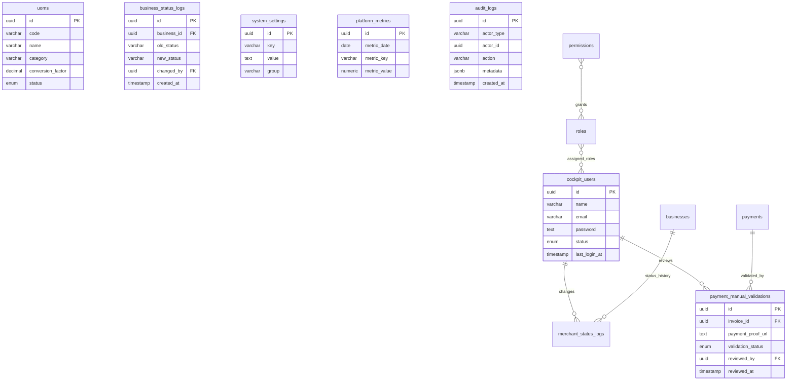

# Overview

## Objective

Cockpit merupakan modul internal platform Sollu yang digunakan oleh tim internal untuk:

- Monitoring seluruh merchant
- Monitoring seluruh outlet
- Monitoring subscription & billing
- Validasi pembayaran manual
- Customer support
- Global master data management
- Platform analytics
- Business intelligence
- Platform operation monitoring

Cockpit bukan bagian dari aplikasi dashboard namun masih dalam satu project dan memiliki:

- User management sendiri
- Authentication sendiri (dibedakan guard dengan merchant/bisnis)
- Authorization mengikuti aturan yang ada pada package spatie/laravel-permission
- Dashboard sendiri

Cockpit berfungsi sebagai:

```txt
Platform Control Center
```

untuk seluruh ekosistem Sollu.

---

## Goals

- Menjadi pusat operasional platform
- Mempermudah monitoring merchant
- Mempermudah customer support
- Mengelola billing dan subscription
- Menyediakan data untuk pengambilan keputusan bisnis
- Menjadi fondasi untuk scaling platform

---

## Non Goals

- Merchant operational management
- POS transaction processing
- Merchant inventory management
- Merchant employee management

---

# Requirements

## Functional Requirements

### Merchant Management

Tim internal dapat:

- Melihat seluruh merchant
- Mencari merchant
- Melihat detail merchant
- Suspend merchant
- Reactivate merchant
- Melihat histori aktivitas merchant

---

### Outlet Monitoring

Tim internal dapat:

- Melihat seluruh outlet
- Melihat jumlah outlet aktif
- Melihat outlet yang tidak aktif
- Monitoring penggunaan outlet

---

### Subscription Management

Cockpit dapat:

- Melihat seluruh subscription
- Melihat status langganan
- Melihat invoice
- Melihat pembayaran
- Melakukan validasi pembayaran manual
- Extend subscription
- Suspend subscription

---

### Manual Payment Validation

Support:

- Transfer bank
- Upload bukti pembayaran
- Validasi manual admin
- Reject pembayaran
- Approve pembayaran

---

### Customer Support Management

Support agent dapat:

- Mencari merchant
- Melihat subscription
- Melihat aktivitas merchant
- Melihat audit log
- Melihat error log

---

### Global Master Data Management

Cockpit mengelola data global yang digunakan seluruh merchant.

### Global UOM Management

Contoh:

| Code | Name       |
| ---- | ---------- |
| PCS  | Pieces     |
| BOX  | Box        |
| KG   | Kilogram   |
| G    | Gram       |
| L    | Liter      |
| ML   | Milliliter |

Merchant dapat:

- Menggunakan UOM global

---

### Global Business Type Management

Contoh:

| Business Type |
| ------------- |
| Retail        |
| F&B           |
| Service       |
| Pharmacy      |
| Laundry       |
| Salon         |

---

### Platform Configuration

Support:

- Tax presets
- Currency presets
- Default settings
- Feature flags
- System parameters

---

### User Management

Cockpit memiliki user sendiri.

---

## Supported Roles

| Role             | Description           |
| ---------------- | --------------------- |
| Super Admin      | Full access           |
| Finance Admin    | Billing               |
| Support Agent    | Customer support      |
| Operations Admin | Merchant monitoring   |
| Product Admin    | Master data           |
| Analyst          | Dashboard & analytics |

---

### Platform Dashboard

Dashboard digunakan untuk:

- Monitoring kesehatan bisnis
- Monitoring pertumbuhan platform
- Menentukan strategi bisnis

---

## Non Functional Requirements

| Category     | Requirement               |
| ------------ | ------------------------- |
| Scalability  | Support >100.000 merchant |
| Security     | Internal-only access      |
| Reliability  | High availability         |
| Auditability | Full audit trail          |
| Performance  | Dashboard <2 sec          |

---

# Core Feature

## 1. Bussiness/Merchant Management

### Features

- Merchant list
- Merchant detail
- Merchant search
- Merchant status management

---

### Merchant Detail View

Menampilkan:

- Merchant profile
- Subscription
- Invoice history
- Outlet count
- Revenue contribution
- Activity history

---

## 2. Subscription & Billing Management

### Features

- Subscription monitoring
- Invoice monitoring
- Payment validation
- Renewal management
- Suspension management

### Payment Validation Flow

```txt
Merchant Upload Payment Proof
          ↓
Waiting Validation
          ↓
Finance Review
          ↓
Approve / Reject
          ↓
Subscription Updated
```

---

## 3. Global UOM Management

### Features

- Create UOM
- Update UOM

## 4. Platform Configuration

### Features

- Feature flag management
- Global configuration
- Maintenance mode
- Subscription pricing

---

## 5. Customer Support Console

Support dapat:

- Search merchant
- View merchant status
- View subscription
- View logs
- View tickets (future)

---

## 6. Audit & Activity Monitoring

### Features

- User activity log
- Merchant activity log
- Billing activity log
- Configuration change log

---

## 7. Business Intelligence Dashboard

### KPI Dashboard

Menampilkan:

- MRR
- ARR
- Merchant growth
- Outlet growth
- Churn rate
- Conversion rate
- Active merchants
- Revenue trend

---

# Business Metrics

## Monthly Recurring Revenue

$MRR = \sum \text{Active Subscription Revenue}$

## Churn Rate

$\text{Churn Rate} = \frac{\text{Lost Customers}}{\text{Total Customers}} \times 100\%$

## Merchant Growth

$\text{Growth Rate} = \frac{\text{Current Period} - \text{Previous Period}}{\text{Previous Period}} \times 100\%$

---

# User Flow

## Merchant Monitoring Flow

```txt
Admin Open Dashboard
        ↓
View Merchant Summary
        ↓
Search Merchant
        ↓
View Merchant Detail
        ↓
Perform Action
```

---

## Payment Validation Flow

```txt
Open Validation Queue
        ↓
Review Payment Proof
        ↓
Approve / Reject
        ↓
Update Subscription
        ↓
Notify Merchant
```

---

## Global UOM Management Flow

```txt
Open UOM Module
        ↓
Create/Edit UOM
        ↓
Save Changes
        ↓
Publish Globally
```

---

## Dashboard Analytics Flow

```txt
Open Cockpit Dashboard
        ↓
Load KPI Metrics
        ↓
Load Growth Charts
        ↓
Generate Insights
```

---

# Architecture

## High Level Architecture



---

## Suggested Architecture Pattern

### Recommended

```txt
Modular Monolith
```

---

### Future Split

- Billing Service
- Analytics Service
- Support Service
- Merchant Service

---

## Important System Design

### Cockpit Isolation

Cockpit harus:

```txt
Terpisah subdomain dengan dashboard, namun masih dalam satu project (Monolith)
```

---

### Separate

- Authentication
- Authorization
- UI
- Routes
- Permissions

---

## Feature Flag System

Cockpit dapat:

```txt
Enable / Disable
fitur tertentu
per merchant
```

---

## Merchant Lifecycle Control

Support:

- Active
- Suspended
- Trial
- Expired
- Archived

---

## DB Schema



---

# Technical Notes

## Recommended Stack

- Laravel / Node.js
- PostgreSQL
- Redis
- Queue Worker
- ClickHouse (future analytics)

---

## Recommended Route Structure

### Business

```http
GET /businesses
GET /businesses/:id
PUT /businesses/:id/reactive
DELETE /businesses/:id/suspend
```

### Subscription

```http
GET masters/subscriptions
GET masters/subscriptions/:id
POST masters/subscriptions
PUT masters/subscriptions/:id
DELETE masters/subscriptions/:id
```

### Invoice

```http
GET /invoices
POST /invoices/:id/payment-validations/approve
POST /invoices:/id/payment-validations/reject
```

---

### UOM

```http
GET masters/uoms
GET masters/uoms/:id
POST masters/uoms
PUT masters/uoms/:id
DELETE masters/uoms/:id
```

---

### Dashboard

```http
GET /dashboard
GET /dashboard/analytics
```

---

## Suggested Structure Folder

### Controller

- app/Http/Controllers/Cockpit/AuthenticationController
- app/Http/Controllers/Cockpit/DashboardController
- app/Http/Controllers/Cockpit/Master/SubscriptionController
- app/Http/Controllers/Cockpit/InvoiceController
- app/Http/Controllers/Cockpit/BusinessController
- dll

### Page

- resources/js/Layout/AppCockpitLayout.vue
- resources/js/Pages/Cockpit/Dashboard/Index.vue
- dll

---

## Suggested Permission Naming

```txt
bussiness.read
bussiness.update
bussiness.suspend

cockpit.subscription.read
cockpit.subscription.update

payment.validate

uom.read
uom.create
uom.update
uom.delete

analytics.read

audit.read
```

---

## Important Technical Considerations

### 1. Separate Authentication

Cockpit user tidak boleh menggunakan:

```txt
users
```

Gunakan:

```txt
cockpit_users
```

---

### 2. Full Audit Logging

Semua aktivitas cockpit wajib tercatat.

---

### 3. Dashboard Aggregation

Dashboard harus menggunakan:

```txt
aggregation tables
```

Bukan query langsung ke tabel transaksi merchant.

---

### 4. Merchant Impact Analysis

Dashboard harus dapat menjawab:

- Merchant mana yang paling aktif?
- Merchant mana yang berpotensi churn?
- Industri apa yang tumbuh paling cepat?
- Fitur apa yang paling sering digunakan?

---

## Security Considerations

### Required

- MFA support
- IP restriction (future)
- Session monitoring
- Activity logging
- Permission-based access

---

## Audit Logging

## Logged Events

- Merchant suspended
- Subscription updated
- Payment validated
- UOM updated
- User login
- Configuration changed

---

## Suggested UX

### Dashboard Home

#### KPI Cards

- Active Merchants
- Active Outlets
- MRR
- Churn Rate
- Trial Conversion
- New Merchants

---

### Business Detail

## Tabs

- Overview
- Subscription
- Outlets
- Users
- Billing
- Activity Logs

---

#### Validation Queue

Finance Admin dapat melihat:

- Pending payment
- Payment proof
- Invoice detail
- Quick approve/reject

---

### Important UX Notes

#### 1. Cockpit is Data Driven

Semua keputusan bisnis platform berasal dari dashboard cockpit.

#### 2. Fast Support Workflow

Support harus dapat menemukan merchant dalam:

```txt
< 10 detik
```

#### 3. Executive Dashboard

Sediakan dashboard khusus founder/management:

- MRR
- ARR
- Growth
- Churn
- LTV
- CAC (future)

---

## Future Extensibility

### Planned Features

- Support Ticket Center
- Live Merchant Monitoring
- Product Usage Analytics
- AI Churn Prediction
- AI Business Insight
- Revenue Forecasting
- CRM Integration
- Affiliate Management
- Partner Portal

---

## Suggested Development Priority

### Phase 1

- Business Merchant Management
- Subscription Management
- Payment Validation
- Global UOM
- Platform Dashboard
- Analytics
- Audit Logs

### Phase 2

- Feature Flags
- Churn Analytics
- Forecasting
- Customer Success Tools
- AI Insights

---

## Success Metrics

| Metric                    | Target     |
| ------------------------- | ---------- |
| Payment Validation Time   | <24 Hours  |
| Merchant Search Time      | <2 Seconds |
| Dashboard Load Time       | <2 Seconds |
| Audit Coverage            | 100%       |
| Platform Metrics Accuracy | 100%       |
