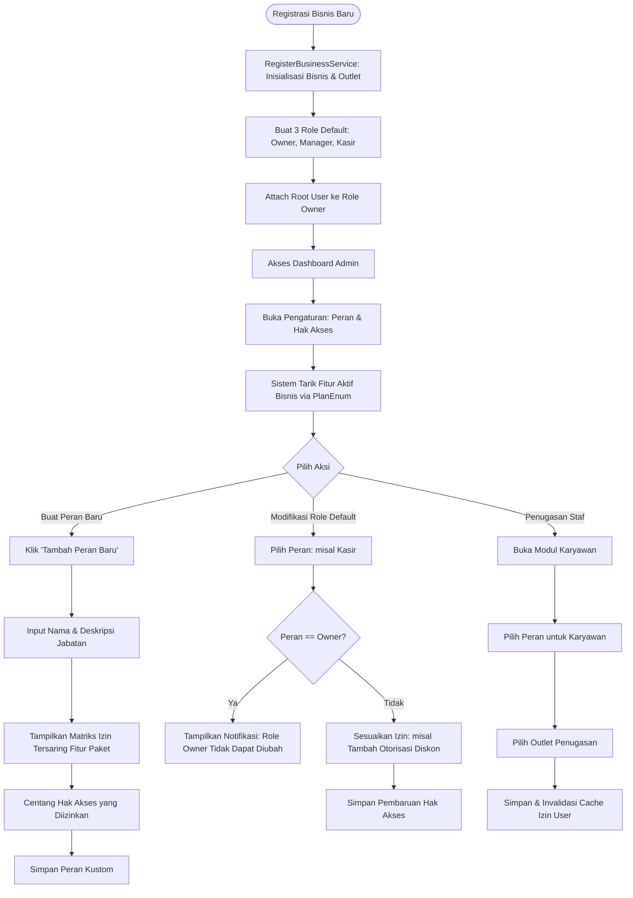
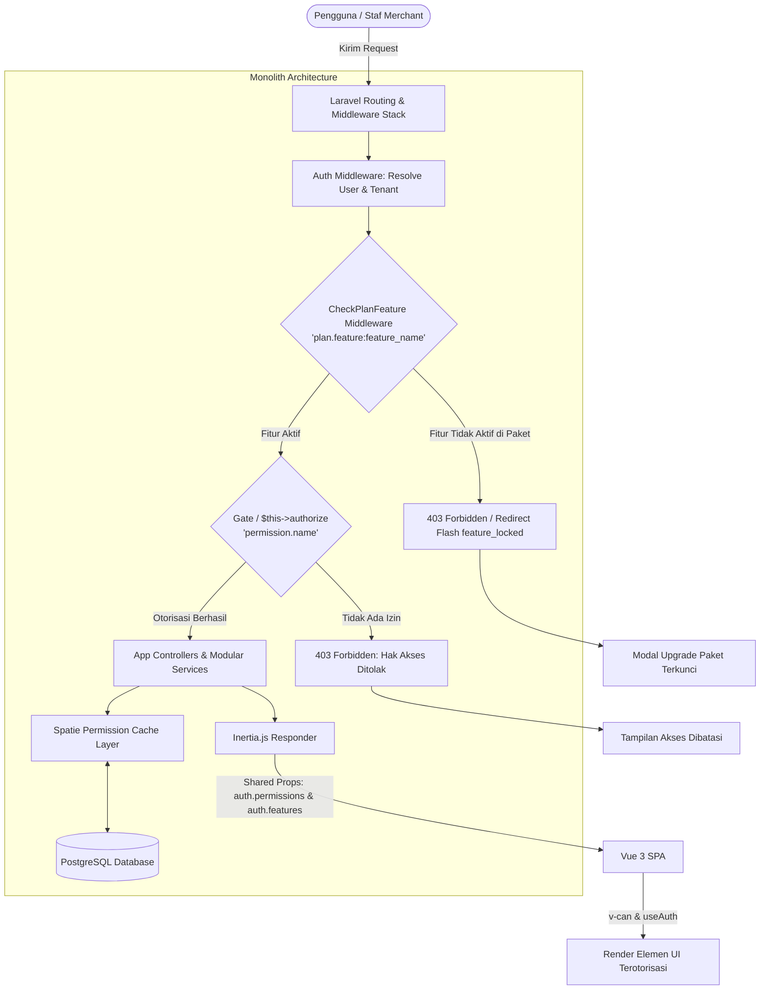
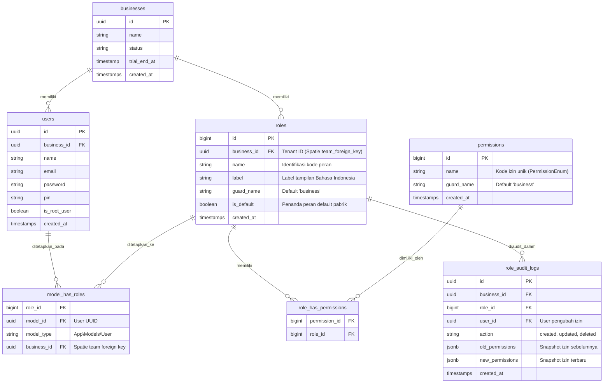

# PRD — Role-Based Access Control (RBAC) & Personalisasi Hak Akses

## 1. Overview

Modul **Role-Based Access Control (RBAC)** pada Sollu App adalah sistem tata kelola otorisasi dan hak akses multi-tenant yang dirancang khusus untuk memenuhi kebutuhan operasional bisnis SaaS POS (Point of Sale). Berbeda dengan sistem otorisasi statis konvensional, modul ini mengimplementasikan isolasi data tingkat bisnis (_tenant-scoped access control_) dan personalisasi peran yang fleksibel namun tetap terlindungi oleh batasan keamanan ketat (_anti-lockout guardrails_).

Setiap kali merchant baru mendaftar pada platform Sollu, sistem secara otomatis melakukan _provisioning_ tiga peran bawaan standar industri F&B dan Retail:

1. **Pemilik / Admin (Owner)**: Memiliki kendali penuh terhadap seluruh konfigurasi bisnis, data finansial, operasional outlet, dan manajemen pengguna. Akun pendaftar pertama (_Root User_ dengan status `is_root_user = true`) langsung terikat secara permanen pada peran ini.
2. **Manajer (Manager)**: Bertanggung jawab atas supervisi operasional harian, pengelolaan katalog produk, persetujuan penyesuaian stok (_stock adjustment_), otorisasi void transaksi, dan inspeksi laporan.
3. **Kasir (Cashier)**: Berfokus langsung pada antarmuka transaksi kasir (POS), buka/tutup shift, penerimaan pembayaran, dan pencetakan struk.

Platform memberikan kebebasan bagi pengguna terotorisasi untuk melakukan **personalisasi hak akses**. Pengguna dapat membuat peran kustom baru (misalnya _Supervisor_, _Barista_, _Staff Gudang_, atau _Akuntan_) serta memodifikasi hak akses pada peran bawaan (seperti mengaktifkan atau menonaktifkan wewenang pemberian diskon manual pada kasir).

Pilar penting arsitektur modul ini adalah **Sinkronisasi Dinamis dengan Feature Plan (Dual-Layer Authorization)**. Hak akses operasional pengguna (_RBAC Permission_) tidak pernah berdiri terpisah dari kapabilitas paket langganan merchant (_Tenant Feature Plan_). Ketika admin mengonfigurasi hak akses peran, daftar izin yang dapat dipilih secara otomatis tersaring dan tersinkronisasi dengan daftar fitur (`FeatureEnum`) yang aktif pada paket langganan merchant (`PlanEnum`). Hal ini memastikan tidak ada celah di mana seorang staf dapat diberikan hak akses atas fitur yang belum dilanggani oleh merchant.

## 2. Requirements

- **Target Pengguna:**
    - _Pemilik Bisnis (Merchant Owner)_: Membutuhkan kemudahan delegasi tugas tanpa khawatir privasi data finansial atau wewenang kritis disalahgunakan.
    - _General Manager / Outlet Manager_: Memerlukan wewenang operasional cepat di lapangan sesuai tanggung jawabnya.
    - _Staf Operasional (Kasir/Staff)_: Membutuhkan antarmuka kerja yang fokus, bersih dari menu-menu yang tidak relevan dengan tugasnya.
- **Prinsip Dual-Layer Auth (Zero Trust RBAC):**
    - **Layer 1 (Tenant Entitlement):** Apakah merchant memiliki paket langganan yang mencakup fitur terkait (`FeatureEnum`)?
    - **Layer 2 (User Authorization):** Apakah staf yang bersangkutan memiliki izin operasional terkait (`PermissionEnum`)?
    - Keduanya wajib bernilai `true` agar suatu aksi atau tampilan dapat diakses.
- **Tenant Isolation (Multi-Tenancy):**
    - Setiap peran (`Role`) terikat pada ID bisnis tertentu (`business_id`).
    - Perubahan nama atau izin peran pada Bisnis A sama sekali tidak boleh berdampak pada Bisnis B.
- **Root User & Core Guardrails:**
    - Akun _Root User_ (`is_root_user = true`) dan peran _Pemilik (Owner)_ bersifat _immutable_ (tidak dapat dihapus atau diturunkan hak aksesnya) guna mencegah merchant terkunci (_lockout_).
    - Mencegah eskalasi hak istimewa (_Privilege Escalation_): Pengguna non-owner tidak dapat memberikan izin kepada peran lain yang melebihi hak yang dimilikinya sendiri.
- **Desain & UX:**
    - Matriks hak akses disajikan dalam bentuk hierarki terkelompok (_grouped permission matrix_) yang intuitif.
    - Fitur yang terkunci di luar paket langganan wajib menampilkan indikator visual (_FeatureLock Badge_ / Banner Upsell) yang rapi tanpa merusak tata letak antarmuka.
    - Perubahan hak akses berlaku instan (_real-time cache invalidation_) pada sesi pengguna berikutnya.

## 3. Core Features

- **Tenant Role Auto-Provisioning:** Inisialisasi otomatis peran default saat bisnis pertama kali dibuat via `RegisterBusinessService`:
    - Peran `owner` (Pemilik Usaha) dengan seluruh permission aktif.
    - Peran `manager` (Manager Outlet/Umum) dengan izin supervisi dan inventori.
    - Peran `cashier` (Kasir) dengan izin transaksi dasar dan buka/tutup kasir.
    - Otomatisasi pengikatan akun pendaftar utama (_Root User_) ke peran `owner`.
- **Custom Role Management (CRUD):**
    - _Buat Peran Kustom:_ Pengguna dapat menambahkan peran baru dengan nama dan deskripsi spesifik (misal: "Barista Head", "Admin Pembelian").
    - _Edit & Personalisasi Peran:_ Modifikasi wewenang peran default (selain Owner) dan peran kustom melalui daftar centang izin yang fleksibel.
    - _Hapus Peran Terproteksi:_ Pencegahan penghapusan peran jika peran tersebut masih digunakan oleh staf aktif, serta pelarangan mutlak penghapusan peran default `owner`.
    - _Kloning Peran (Role Duplication):_ Mempercepat pembuatan peran baru dengan menyalin izin dari peran yang sudah ada sebagai template awal.
- **Plan-Synced Permission Matrix:**
    - Pengelompokan izin berbasis modul aplikasi yang jelas (Penjualan/Kasir, Produk, Inventori, Pembelian/PO, Promo, Pelanggan/CRM, Laporan, dan Pengaturan Sistem).
    - _Sinkronisasi Otomatis:_ Matriks izin hanya mengaktifkan modul yang tersedia di paket langganan bisnis saat ini (`PlanEnum`). Izin yang membutuhkan paket lebih tinggi akan berstatus nonaktif dengan badge pengunci (`<FeatureLock>`).
- **Employee Assignment & Outlet Scoping:**
    - Penugasan peran ke satu atau banyak staf melalui modul Karyawan.
    - Dukungan _Multi-Outlet Scope_: Staf dapat memiliki peran tertentu yang dibatasi pada cabang/outlet spesifik yang ditugaskan.
    - Indikator visual peran pengguna pada tabel direktori staf.
- **Security Guardrails & Audit Logging:**
    - _Anti-Lockout Engine:_ Validasi backend yang menolak aksi penghapusan peran `owner` atau pencabutan hak akses krusial dari `is_root_user`.
    - _Anti-Privilege Escalation:_ Pengguna hanya dapat mengalokasikan izin yang berada di dalam lingkup wewenang yang mereka miliki.
    - _Audit Trail:_ Pencatatan riwayat perubahan hak akses (siapa yang mengubah izin peran, waktu modifikasi, serta daftar perubahan izin sebelum dan sesudah).

## 4. User Flow

**Perjalanan Pemilik Usaha / Admin:**

1. Pengguna menyelesaikan pendaftaran bisnis dan otomatis mendapatkan status _Root User_ dengan peran `owner`.
2. Admin masuk ke menu **Pengaturan > Peran & Hak Akses** untuk meninjau peran bawaan yang sudah terbentuk otomatis.
3. Untuk membuat variasi jabatan baru, Admin mengklik tombol **"Tambah Peran"**.
4. Sistem menyajikan antarmuka form pembuatan peran dengan matriks izin yang otomatis disaring berdasarkan paket langganan aktif (`PlanEnum`):
    - Izin dari modul aktif dapat dicentang secara bebas.
    - Izin dari modul di luar paket ditampilkan dalam status terkunci dengan banner informasi upgrade.
5. Admin memilih kombinasi wewenang yang diinginkan lalu menyimpan peran.
6. Admin membuka menu **Karyawan** dan menugaskan staf kasir atau staf outlet ke peran yang sesuai.

**Perjalanan Staf Lapangan (Manajer / Kasir):**

1. Staf melakukan login menggunakan kredensial email/PIN.
2. Sistem secara otomatis mengevaluasi izin peran staf melalui directive `v-can` dan composable `useAuth()`:
    - Menu, tombol, dan aksi yang tidak diizinkan disembunyikan secara bersih dari tampilan antarmuka.
3. Saat staf mencoba mengakses rute atau mengeksekusi request yang membutuhkan otorisasi tinggi, backend melakukan verifikasi ganda via Gate/Policy (`$this->authorize`).
4. Jika tidak berhak, sistem menampilkan respons 403 Forbidden tanpa membocorkan struktur data internal.

## 5. Architecture

Sistem mengadopsi pendekatan **Dual-Layer Guard Monolith** yang memadukan keamanan langganan SaaS (_Tenant Entitlements_) dan otorisasi operasional staf (_RBAC Permissions_). Setiap permintaan diproses melalui filter bertingkat sebelum menyentuh lapisan logika bisnis.

## 6. Database Schema

Skema database memanfaatkan arsitektur multi-tenant berbasis tim pada package `spatie/laravel-permission` yang dipadukan dengan database relasional PostgreSQL. Kolom `business_id` digunakan sebagai pemisah (_tenant foreign key_) pada entitas peran.

**Daftar Tabel:**

- `businesses`: Menyimpan entitas bisnis/merchant penyewa SaaS.
- `users`: Menyimpan data akun staf dan kredensial, dilengkapi atribut `is_root_user` dan relasi `business_id`.
- `roles`: Menyimpan peran per bisnis (`business_id`), nama peran, label Bahasa Indonesia, dan flag `is_default`.
- `permissions`: Menyimpan katalog seluruh kunci izin aplikasi (`PermissionEnum`) yang berlaku secara global.
- `role_has_permissions`: Tabel pivot relasi Many-to-Many antara `roles` dan `permissions`.
- `model_has_roles`: Tabel pivot penetapan `roles` kepada model `User` berlingkup `business_id`.
- `role_audit_logs`: Menyimpan rekam jejak audit histori perubahan izin pada peran.

## 7. Tech Stack

- **Frontend:** **Vue.js 3 (Composition API & `<script setup>`)** + **Tailwind CSS v4** (Styling modern dan responsif).
    - Otorisasi Template: Directive kustom `v-can` untuk RBAC dan `v-feature` untuk pembatasan paket.
    - State & Composables: `@/Composable/useAuth` (`can()`, `canAny()`, `isOwner()`) dan `@/Composable/usePlanFeature` (`hasFeature()`, `requireFeature()`).
    - Visual Lock UI: Komponen `<FeatureLock>` dan `<FeatureLockOverlay>` untuk membungkus section izin yang belum terbuka di paket aktif.
- **Penghubung (Bridge):** **Inertia.js 1.2**
    - Mengalirkan status otorisasi dari Laravel secara aman ke Vue SPA melalui shared props `$page.props.auth.permissions` dan `$page.props.auth.features`.
    - Mengelola flash session redirect `feature_locked` secara otomatis saat pengguna mencoba mengakses endpoint di luar tier paketnya.
- **Backend:** **Laravel 11.9+ (PHP 8.3)**
    - Otorisasi terpusat menggunakan Gate / Policy via method `$this->authorize('permission.name')` pada Controller dan Form Request berbasis `BaseInertiaFormRequest`.
    - Service Layer modular mandiri: `App\Services\App\Role\RoleService`.
- **RBAC Engine:** **`spatie/laravel-permission` (v6.x)**
    - Dikonfigurasi dengan mode `teams => true` menggunakan `business_id` sebagai `team_foreign_key` untuk isolasi multi-tenant yang ketat.
    - Menggunakan caching performa tinggi untuk lookup izin instan tanpa pembebanan query database berulang.
- **Database:** **PostgreSQL 16**
    - Mengoptimalkan tipe data UUID untuk entitas multi-tenant serta JSONB untuk penyimpanan riwayat mutasi izin pada tabel `role_audit_logs`.
- **Single Source of Truth (Enums):**
    - `App\Enums\RoleEnum` (Definisi nama dan label peran default).
    - `App\Enums\PermissionEnum` (Definisi seluruh kunci hak akses sistem).
    - `App\Enums\FeatureEnum` (Definisi kapabilitas fitur paket SaaS).
    - `App\Enums\PlanEnum` (Mapping kepemilikan fitur per tier langganan).
